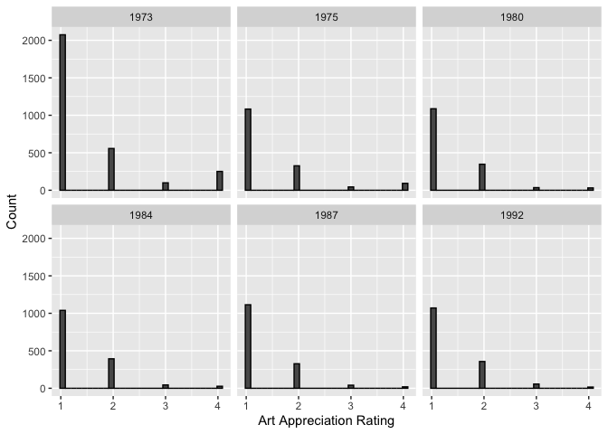
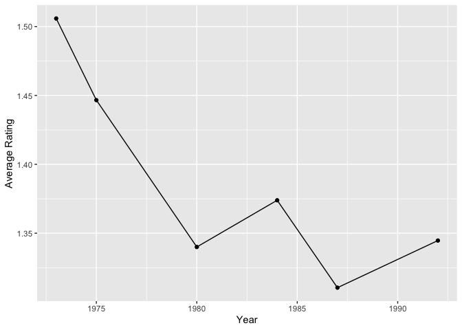

Portfolio1: Art Attitudes
================
Conor Lacey
2023-01-27

``` r
suppressWarnings(library(tidyverse))
```

    ## ── Attaching packages ─────────────────────────────────────── tidyverse 1.3.2 ──
    ## ✔ ggplot2 3.4.0     ✔ purrr   0.3.4
    ## ✔ tibble  3.1.8     ✔ dplyr   1.0.8
    ## ✔ tidyr   1.1.4     ✔ stringr 1.4.0
    ## ✔ readr   2.1.3     ✔ forcats 0.5.1
    ## ── Conflicts ────────────────────────────────────────── tidyverse_conflicts() ──
    ## ✖ dplyr::filter() masks stats::filter()
    ## ✖ dplyr::lag()    masks stats::lag()

In this portfolio I explore The Americans and Arts study. Which is “a
series of studies measuring participation in and attitudes about the
arts and arts in education.” The study took place during the years of
1973, 1975, 1980, 1984, 1987, and 1992. In general my goal is took look
at various questions asked in this data set regarding attitudes towards
the arts and how they’ve changed over time.

First let’s load the data

``` r
#1973
load("DS0001/35575-0001-Data.rda")
D1973<-da35575.0001
rm(da35575.0001)

#1975
load("DS0002/35575-0002-Data.rda")
D1975<-da35575.0002
rm(da35575.0002)

#1980
load("DS0003/35575-0003-Data.rda")
D1980<-da35575.0003
rm(da35575.0003)

#1984
load("DS0004/35575-0004-Data.rda")
D1984<-da35575.0004
rm(da35575.0004)

#1987
load("DS0005/35575-0005-Data.rda")
D1987<-da35575.0005
rm(da35575.0005)

#1992
load("DS0006/35575-0006-Data.rda")
D1992<-da35575.0006
rm(da35575.0006)
```

Alright so among all the data sets, they share one question in
particular that I find interesting which is:

“Some people think that classes in the arts should be taught in public
schools for children to learn and get credit for, just like math or
science or English. Other people think that classes like those should be
given, but only after school or as a non-credit activity; and still
others don’t think they should be given at all. In your opinion, should
the public schools in this area teach courses in art appreciation for
credit, should it be an after-school or non-credit course, or should it
not be offered at all?”

So essentially I’m interested in seeing how the answer to this question
varies over time.

So now comes the tricky part. I have to merge these data sets…

First let’s reformat each data frame so it has the same structure

``` r
library(expss) %>% suppressWarnings() %>% suppressPackageStartupMessages()

#1973
D1973 <- D1973 %>%  
  select(CASEID, Q26A_7) %>%
  rename("Art_Appreciation" = "Q26A_7") %>%
  mutate(Year = 1973) %>% 
  mutate(Art_Appreciation = as.character(Art_Appreciation)) %>%
  mutate(Art_Appreciation = dplyr::recode(Art_Appreciation,
                                   "(1) Teach for credit" = "1",
                                   "(2) Non-credit" = "2",
                                   "(3) Should not offer at all" = "3",
                                   "(4) Not sure" = "4")) %>%
  mutate(Art_Appreciation = as.numeric(Art_Appreciation)) %>%
  apply_labels(CASEID = "",
               Art_Appreciation = "",
               Year = "")

#1975
D1975 <- D1975 %>%  
  select(CASEID, Q17C_11) %>%
  rename("Art_Appreciation" = "Q17C_11") %>%
  mutate(Year = 1975) %>% 
  mutate(Art_Appreciation = as.character(Art_Appreciation)) %>%
  mutate(Art_Appreciation = dplyr::recode(Art_Appreciation,
                                   "(1) Teach for credit" = "1",
                                   "(2) Non-credit" = "2",
                                   "(3) Not at all" = "3",
                                   "(4) Not sure" = "4")) %>%
  mutate(Art_Appreciation = as.numeric(Art_Appreciation)) %>%
  apply_labels(CASEID = "",
               Art_Appreciation = "",
               Year = "")

#1980
D1980 <- D1980 %>%  
  select(CASEID, Q14C_11) %>%
  rename("Art_Appreciation" = "Q14C_11") %>%
  mutate(Year = 1980) %>% 
  mutate(Art_Appreciation = as.character(Art_Appreciation)) %>%
  mutate(Art_Appreciation = dplyr::recode(Art_Appreciation,
                                   "(1) Teach for credit" = "1",
                                   "(2) Non-credit" = "2",
                                   "(3) Not at all" = "3",
                                   "(4) Not sure" = "4")) %>%
  mutate(Art_Appreciation = as.numeric(Art_Appreciation)) %>%
  apply_labels(CASEID = "",
               Art_Appreciation = "",
               Year = "")

#1984
D1984 <- D1984 %>%  
  select(CASEID, Q16C_11) %>%
  rename("Art_Appreciation" = "Q16C_11") %>%
  mutate(Year = 1984) %>% 
  mutate(Art_Appreciation = as.character(Art_Appreciation)) %>%
  mutate(Art_Appreciation = dplyr::recode(Art_Appreciation,
                                   "(1) Teach for credit" = "1",
                                   "(2) Non-credit" = "2",
                                   "(3) Not at all" = "3",
                                   "(4) Not sure" = "4")) %>%
  mutate(Art_Appreciation = as.numeric(Art_Appreciation)) %>%
  apply_labels(CASEID = "",
               Art_Appreciation = "",
               Year = "")

#1987
D1987 <- D1987 %>%  
  select(CASEID, Q15D_9) %>%
  rename("Art_Appreciation" = "Q15D_9") %>%
  mutate(Year = 1987) %>% 
  mutate(Art_Appreciation = as.character(Art_Appreciation)) %>%
  mutate(Art_Appreciation = dplyr::recode(Art_Appreciation,
                                   "(1) Teach for credit" = "1",
                                   "(2) Non-credit" = "2",
                                   "(3) Not at all" = "3",
                                   "(4) Not sure" = "4")) %>%
  mutate(Art_Appreciation = as.numeric(Art_Appreciation)) %>%
  apply_labels(CASEID = "",
               Art_Appreciation = "",
               Year = "")

#1992
D1992 <- D1992 %>%  
  select(CASEID, Q13I_7) %>%
  rename("Art_Appreciation" = "Q13I_7") %>%
  mutate(Year = 1987) %>% 
  mutate(Art_Appreciation = as.character(Art_Appreciation)) %>%
mutate(Art_Appreciation = dplyr::recode(Art_Appreciation,
                                 "(1) Teach for credit" = "1",
                                 "(2) After school non-credit" = "2",
                                 "(3) Not at all" = "3",
                                 "(4) Not sure" = "4")) %>%
mutate(Art_Appreciation = as.numeric(Art_Appreciation)) %>%
  apply_labels(CASEID = "",
               Art_Appreciation = "",
               Year = "")

detach("package:expss")
```

PHEW! That’s a lot of data. Now let’s merge it all together by combining
the rows

``` r
art_attitudes<-bind_rows(D1973,D1975,D1980,D1984,D1987,D1992)

head(art_attitudes,10)
```

    ##    CASEID Art_Appreciation Year
    ## 1       1                1 1973
    ## 2       2               NA 1973
    ## 3       3                1 1973
    ## 4       4                1 1973
    ## 5       5                1 1973
    ## 6       6                2 1973
    ## 7       7                1 1973
    ## 8       8                4 1973
    ## 9       9                2 1973
    ## 10     10                1 1973

Yay!!! Now we have a working data set that data collected on this
question from 1973 to 1992. Let’s explore it!

First I want to see how the histogram compare

``` r
art_attitudes %>% ggplot(aes(x=Art_Appreciation))+
  facet_wrap(~Year)+
  geom_histogram(color="black")+
  xlab("Art Appreciation Rating")+ 
  ylab("Count")
```

    ## `stat_bin()` using `bins = 30`. Pick better value with `binwidth`.

    ## Warning: Removed 36 rows containing non-finite values (`stat_bin()`).

<!-- -->

They look fairly similar over time. I’m going to dive deeper and look at
the means. However, I do not expect this to look very different.

``` r
# Group by mean of multiple columns
art_means<-art_attitudes %>% group_by(Year) %>% 
  summarise(mean_rating=mean(Art_Appreciation,na.rm = TRUE),
            .groups = 'drop') %>%
  as.data.frame()

art_means %>% ggplot(aes(x=Year, 
                         y=mean_rating))+
  ylab("Average Rating")+
  geom_point()+
  geom_line()
```

<!-- -->
